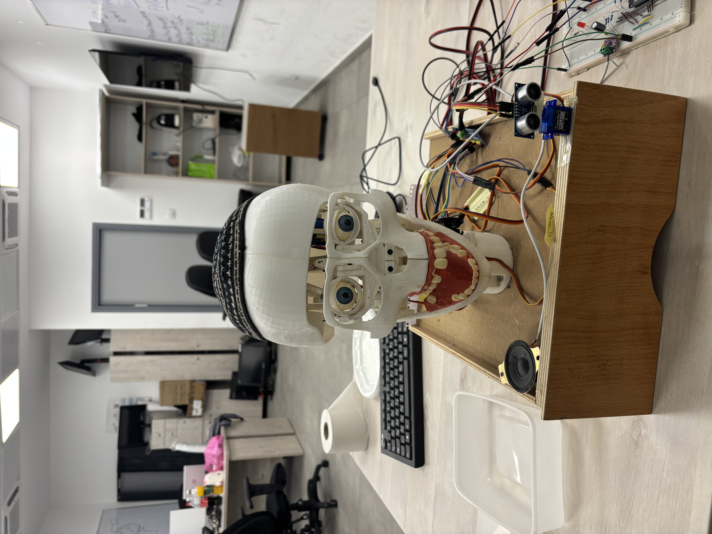
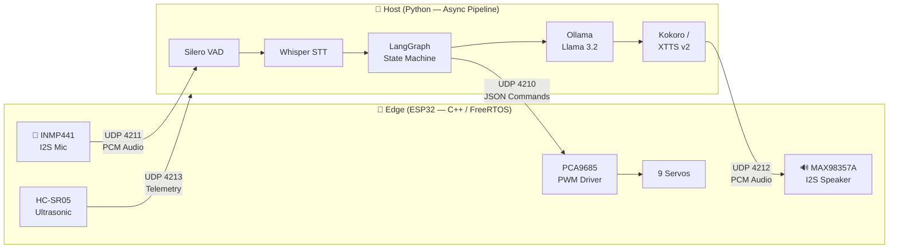
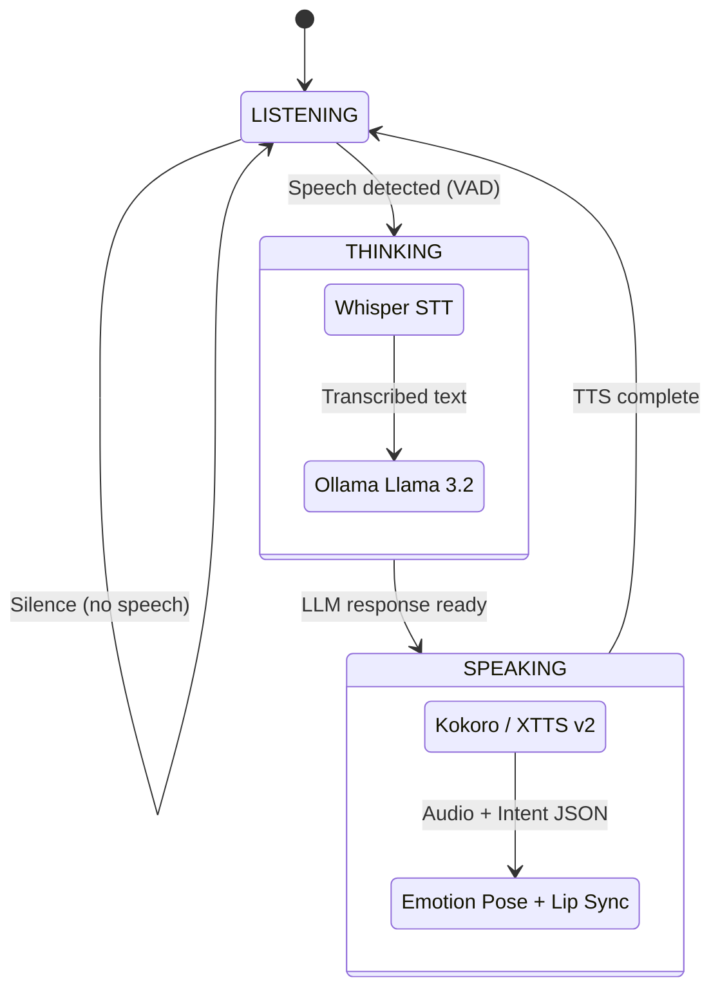
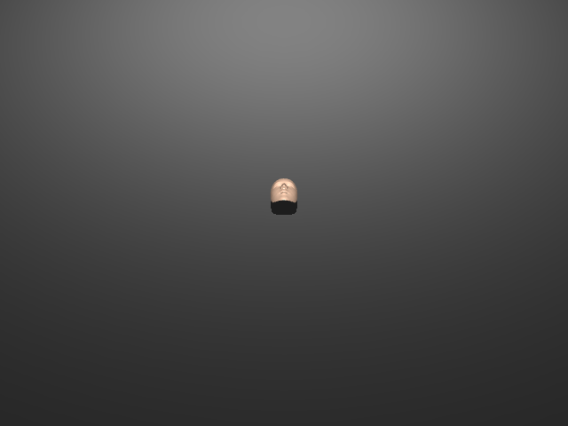
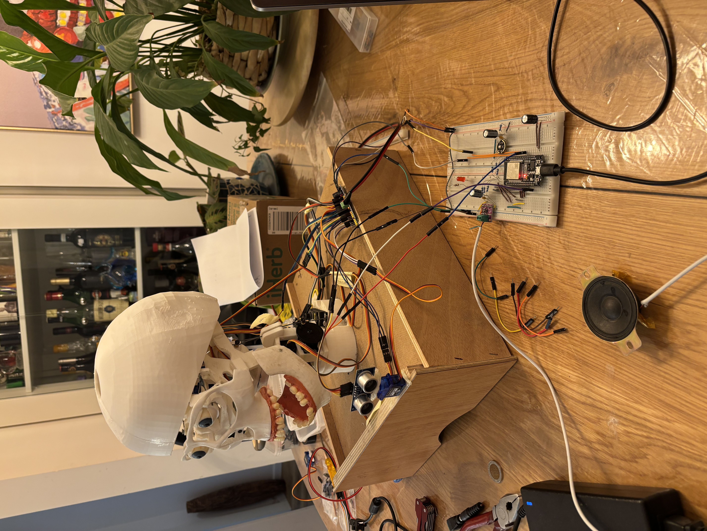
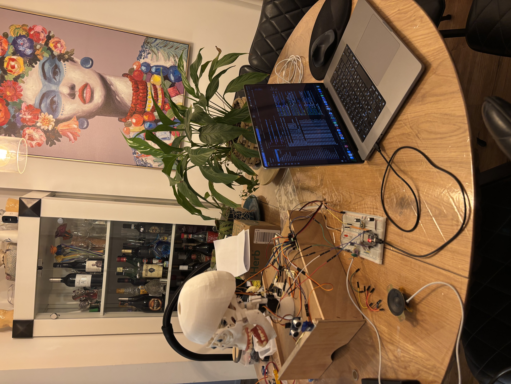
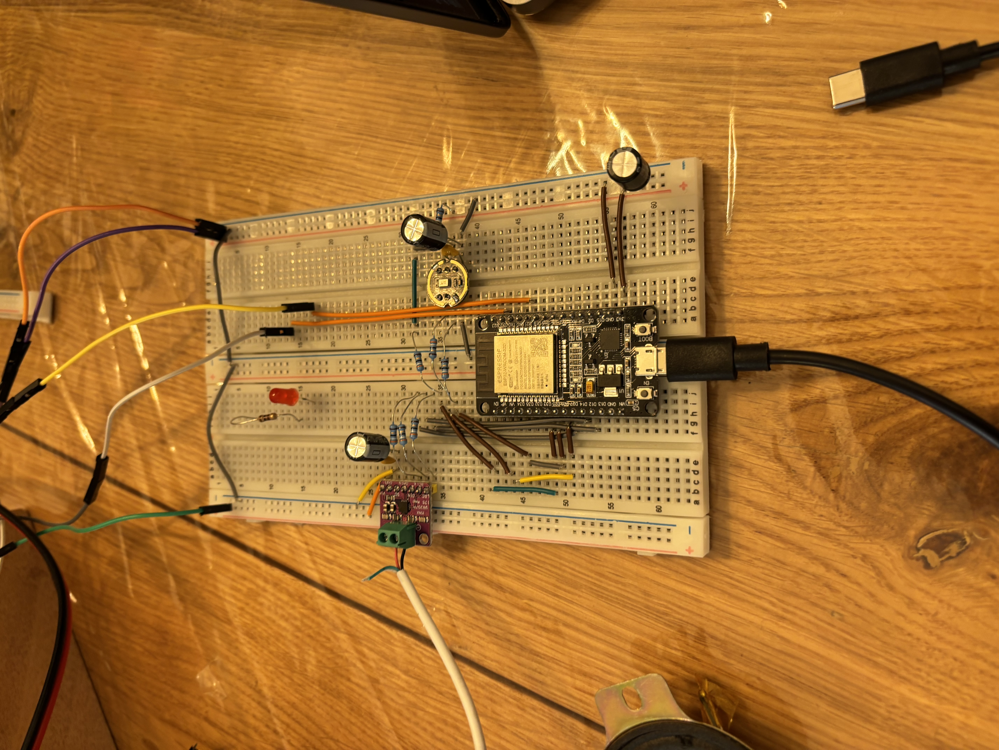
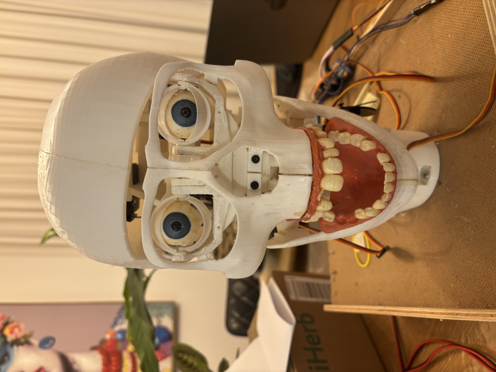
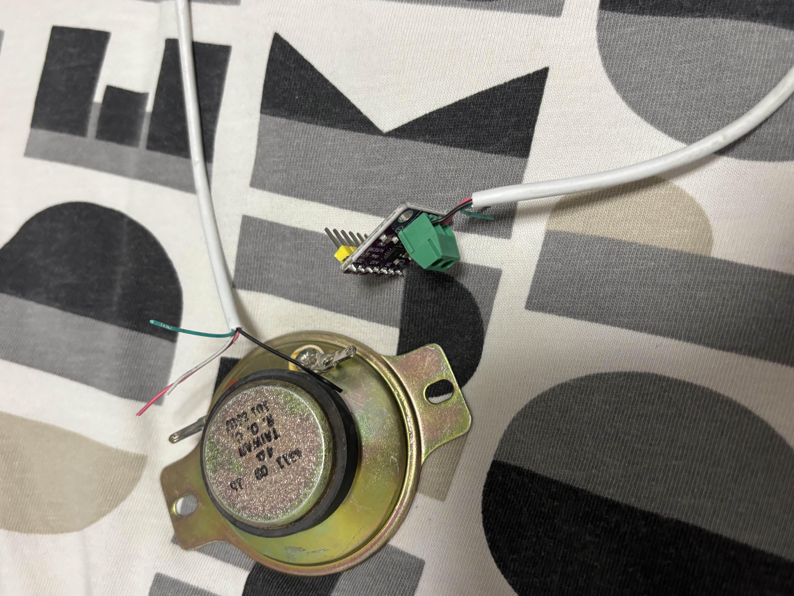
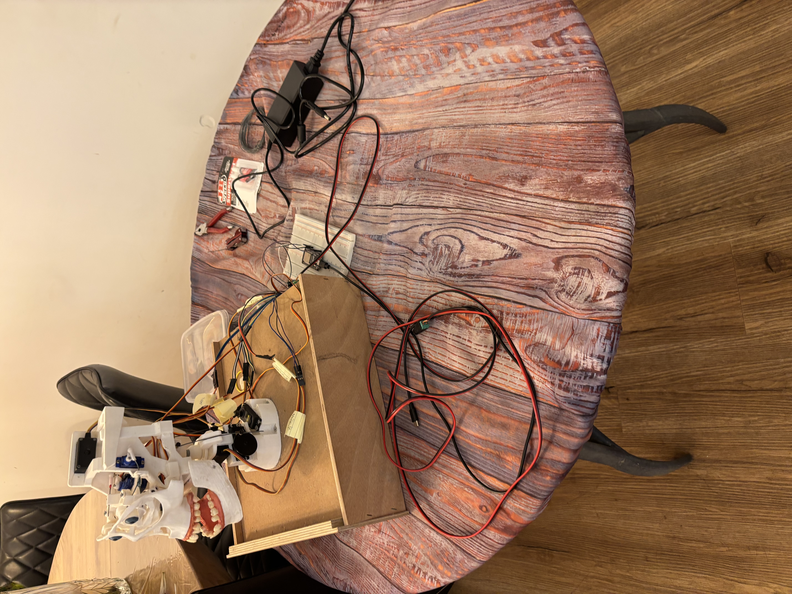

[](LICENSE)
[](https://www.espressif.com/)
[](https://www.python.org/)
[](https://ollama.com/)
[](https://www.freertos.org/)
[](https://docs.astral.sh/ruff/)
[](https://platformio.org/)

# 🎃 EDGAR — LLM-Powered Animatronic Head

> **E**xpressive **D**ynamic **G**enerative **A**nimation **R**obot — An open-source physical robotic avatar that leverages local Large Language Models to hold intelligent conversations, derive context-aware emotions, and express those emotions through lifelike physical servo movements.

<p align="center">
  
</p>

---

## 📋 Table of Contents

- [Features](#-features)
- [System Architecture](#-system-architecture)
- [Hardware Requirements](#-hardware-requirements)
- [Network Topology](#-network-topology)
- [Quick Start](#-quick-start)
  - [Prerequisites](#prerequisites-install-once)
  - [Step 1: Start Ollama](#step-1-start-ollama-and-pull-the-llm-model)
  - [Step 2: Flash ESP32](#step-2-flash-the-esp32-firmware)
  - [Step 3: Install Host Dependencies](#step-3-install-host-python-dependencies)
  - [Step 4: Connect Wi-Fi](#step-4-connect-to-the-network)
  - [Step 5: Run the Host](#step-5-start-the-host-ai-pipeline)
  - [Step 6: Talk!](#step-6-talk-to-edgar)
- [AI Pipeline](#-ai-pipeline)
- [Protocol (Single Source of Truth)](#-protocol--single-source-of-truth)
- [3D Simulator](#-3d-simulator)
- [Project Structure](#-project-structure)
- [Code Quality](#-code-quality)
- [Troubleshooting](#-troubleshooting)
- [Documentation](#-documentation)
- [Gallery](#-gallery)
- [Stopping the System](#-stopping-the-system)
- [Contributing](#-contributing)
- [License](#-license)
- [Acknowledgments](#-acknowledgments)

---

## ✨ Features

| Category | Feature |
|----------|---------|
| 🧠 **AI** | Fully local AI pipeline — no cloud APIs, no internet required |
| 🗣️ **Speech** | Real-time STT (Whisper) + Voice cloning TTS (Kokoro / XTTS v2) |
| 🎭 **Emotion** | LLM-driven emotion inference with 7 physical expression poses |
| 🦾 **Kinematics** | 9-servo expression system at 60 Hz via PCA9685 PWM driver |
| 📡 **Networking** | Dedicated Wi-Fi Access Point (SoftAP) — works anywhere, no router needed |
| ⚡ **Real-time** | FreeRTOS dual-core task architecture with hardware timer ISR |
| 🛡️ **Safety** | Staggered boot sequence, brown-out protection, power watchdog |
| 🎮 **Simulator** | MuJoCo-based 3D skull simulator for development without hardware |
| 📊 **Radar** | HC-SR05 ultrasonic proximity sensor for spatial awareness |
| 💾 **Memory** | Persistent conversation memory with SQLite checkpointing |

---

## 🏗️ System Architecture

This project uses a **Dual-Tier Architecture** separating physical real-time constraints from heavy AI computation:



### The Edge (ESP32)
- Written in **C++** using **FreeRTOS** with dual-core task pinning
- Manages deterministic kinematics (9 servos via PCA9685) and I2S audio routing
- Streams raw PCM audio via ultra-low-latency UDP
- Runs a 60 Hz hardware timer ISR for smooth servo interpolation

### The Host (Python)
- An asynchronous pipeline managed by [`uv`](https://docs.astral.sh/uv/)
- Runs the full AI stack: **Silero VAD → Whisper STT → Ollama LLM → Kokoro/XTTS v2 TTS**
- Uses **LangGraph** for cognitive state management (LISTENING → THINKING → SPEAKING)
- Translates spoken words into text, infers emotional intent, and generates voice + JSON control commands

---

## 🛠️ Hardware Requirements

| Component | Model | Purpose |
|-----------|-------|---------|
| **Microcontroller** | ESP32 Development Board | Dual-core Xtensa @ 240 MHz |
| **Servo Controller** | PCA9685 16-Channel 12-bit PWM | I²C servo control at 60 Hz |
| **Audio Input** | INMP441 I2S MEMS Microphone | Omnidirectional voice capture |
| **Audio Output** | MAX98357A I2S Class-D Amplifier | 3W mono speaker driver |
| **Speaker** | 4Ω 4311 Mid-Range Speaker | Voice output |
| **Actuators** | 2× MG945 + 1× MG995 + 1× HX5010 + 5× SG90 | 9 servo expression system |
| **Power Supply** | 5V 10A AC/DC | Powers all servos + PCA9685 |
| **Proximity** | HC-SR05 Ultrasonic Sensor | Spatial awareness radar |
| **Skull** | 3D-printed ([Thingiverse #2456550](https://www.thingiverse.com/thing:2456550)) | Physical skull housing |

---

## 🔌 Network Topology

The ESP32 creates its own Wi-Fi Access Point — no external router, hotspot, or internet needed:

| Port | Direction | Protocol | Purpose |
|------|-----------|----------|---------|
| `4210` | Host → Edge | JSON/UDP | Control commands (intents, phase updates, emergency stop) |
| `4211` | Edge → Host | PCM/UDP | Audio uplink (raw 16-bit PCM from INMP441 microphone) |
| `4212` | Host → Edge | PCM/UDP | Audio downlink (TTS PCM to MAX98357A speaker) |
| `4213` | Edge → Host | JSON/UDP | Telemetry (heap size, CPU load, servo angles) |

> **Network:** The ESP32 advertises itself as a SoftAP named `Edgar_AP` at `192.168.4.1` and responds to mDNS as `animatronic-head.local`. No hardcoded IPs needed on the host side.

---

## 🚀 Quick Start

### Prerequisites (Install Once)

#### A. PlatformIO CLI (Edge firmware toolchain)
```bash
pip install platformio
```

#### B. uv Package Manager (Host Python toolchain)
```bash
curl -LsSf https://astral.sh/uv/install.sh | sh
```

#### C. Ollama (Local LLM runtime)
```bash
brew install ollama       # macOS
# Or visit https://ollama.com for other platforms
```

#### D. Python 3.11
```bash
uv python install 3.11   # uv manages this automatically
```

---

### Step 1: Start Ollama and Pull the LLM Model

**Terminal 1** — keeps running in the background:
```bash
ollama serve
```

**Terminal 2** — pull the model (one-time ~2 GB download):
```bash
ollama pull llama3.2
ollama list               # Verify llama3.2 appears
```

---

### Step 2: Flash the ESP32 Firmware

> ⚠️ **CRITICAL SAFETY SEQUENCE:** Never flash the ESP32 while the servos are drawing power. Follow this sequence exactly:

1. **Unplug** the 5V 10A power supply from the wall
2. **Connect** the ESP32 to your computer via USB
3. **Flash** the firmware:
   ```bash
   cd edge
   ~/.platformio/penv/bin/pio run --target upload
   ```
4. **Power up servos:** Once upload says `[SUCCESS]`, plug the 5V power supply back in
5. **Monitor** the serial output:
   ```bash
   ~/.platformio/penv/bin/pio device monitor --baud 115200
   ```

**Expected boot output:**
```
-----------------------------------
SYSTEM BOOTING... (115200 Baud)
-----------------------------------

[PowerManager] Dynamic CPU scaling enabled: 80–240 MHz. Light Sleep: ON.
[Kinematics] 60 Hz hardware timer ISR armed.
[Network] SoftAP ACTIVE
[Network]   SSID     : Edgar_AP
[Network]   Password : edgarpassword123
[Network]   AP IP    : 192.168.4.1
[Network] mDNS responder started: animatronic-head.local
Starting Staggered Boot Sequence...
Staggered Boot Complete. System Ready.
```

---

### Step 3: Install Host Python Dependencies

**Terminal 3:**
```bash
cd host
uv sync
```

This creates a `.venv/` and installs all packages from `pyproject.toml`:
- `openai-whisper` — Speech-to-Text
- `tts` — Coqui XTTS v2 (voice cloning)
- `torch` / `torchaudio` — ML inference
- `langchain` / `langgraph` — Cognitive pipeline
- `langchain-ollama` — Ollama LLM integration

---

### Step 4: Connect to the Network

1. Open your laptop's Wi-Fi settings
2. Connect to **`Edgar_AP`** (password: `edgarpassword123`)
3. That's it — your laptop is now on a dedicated, low-latency link to the ESP32

> This eliminates dependency on routers, phone hotspots, or internet. Run the system anywhere — lab, park, or airplane.

---

### Step 5: Start the Host AI Pipeline

```bash
cd host
uv run python main.py
```

**Wiping AI Memory:** If the AI starts acting strangely (repeating phrases, ignoring commands), its conversation context may be polluted. Wipe it:
```bash
uv run python main.py --wipe
```

**Expected startup:**
```
Loading Silero VAD...
Loading Whisper model: base.en on device: mps
Preloading XTTS model...
Starting Cognitive Orchestrator...
UDPVADBridge started. Rate: 16000Hz
Graph entered LISTENING state.
```

> **First run:** Whisper, Silero VAD, and TTS models download automatically (~3 GB). Subsequent runs load from cache.

---

### Step 6: Talk to EDGAR!

The full data flow is now active:

```
You speak → INMP441 mic (ESP32) → UDP → Host
  → Silero VAD (speech segmentation)
  → Whisper STT (speech-to-text)
  → Ollama Llama 3.2 (reasoning + emotion inference)
  → Kokoro / XTTS v2 (text-to-speech with voice cloning)
  → UDP → MAX98357A speaker (ESP32)
  → Lip sync (jaw moves with audio amplitude)
  → Emotion pose (head/eyes express the inferred emotion)
```

---

## 🧠 AI Pipeline



The cognitive pipeline is managed by a **LangGraph** state machine with three phases:

| Phase | What Happens |
|-------|-------------|
| **LISTENING** | Silero VAD monitors audio for speech onset. ESP32 streams mic PCM over UDP. |
| **THINKING** | Whisper transcribes speech → Ollama generates response + emotion → JSON intent sent to ESP32. |
| **SPEAKING** | TTS generates voice audio → streamed to ESP32 speaker. Jaw syncs to audio amplitude. Servos express emotion pose. |

---

## ⚙️ Protocol — Single Source of Truth

All Host ↔ Edge communication is defined in a single schema:

```
protocol/
├── schema.json              # The canonical protocol definition
└── generate_protocol.py     # Code generator (runs as PlatformIO pre-build hook)
```

Running `generate_protocol.py` auto-generates:
- **Python** → `host/protocol/messages.py` (Pydantic models)
- **C++** → `edge/include/controllers/ProtocolParser.h` (ArduinoJson parser)

This ensures the Host and Edge can never go out of sync.

---

## 🎮 3D Simulator

A MuJoCo-based 3D skull simulator enables development without physical hardware:

<p align="center">
  
</p>

```bash
cd host
uv run python simulator/run_3d_simulator.py
```

The simulator renders the skull model with all 9 servo channels mapped to the 3D mesh joints, allowing you to test emotion poses and lip-sync behavior visually.

---

## 📁 Project Structure

```
animatromic head/
├── README.md                          # This file
├── LICENSE                            # MIT License
├── .gitignore                         # Comprehensive ignore rules
├── presentation.html                  # Interactive project presentation
│
├── edge/                              # 🔧 ESP32 Firmware (C++ / FreeRTOS)
│   ├── .clang-format                  # C++ code style (Google-based)
│   ├── platformio.ini                 # Build configuration
│   ├── src/
│   │   ├── main.cpp                   # Entry point & FreeRTOS task setup
│   │   ├── controllers/              # Protocol dispatcher, audio, network, poses
│   │   ├── core/                     # Power management, radar, system tasks
│   │   ├── hardware/                 # PCA9685 I²C driver
│   │   └── motion/                   # Kinematic engine, easing functions
│   ├── include/                       # Header files (mirrors src/ structure)
│   ├── audio_gen/                     # Pre-generated audio clips (.raw)
│   ├── examples/                      # Manual CLI test utility
│   ├── test_hardware/                 # Hardware validation test
│   └── test_mic_standalone/           # Isolated microphone test
│
├── host/                              # 🧠 Python AI Host
│   ├── main.py                        # Entry point
│   ├── pyproject.toml                 # Dependencies & project metadata
│   ├── uv.lock                        # Locked dependency versions
│   ├── core/                          # Cognitive pipeline
│   │   ├── graph.py                   # LangGraph state machine
│   │   ├── orchestrator.py            # Pipeline orchestrator
│   │   ├── llm_manager.py             # Ollama LLM integration
│   │   ├── memory.py                  # SQLite conversation persistence
│   │   └── metrics.py                 # Performance metrics
│   ├── audio/                         # Audio pipeline
│   │   ├── stt.py                     # Whisper speech-to-text
│   │   ├── udp_vad_bridge.py          # UDP ↔ VAD bridge
│   │   └── tts/                       # TTS strategies (Kokoro, XTTS, Piper, macOS)
│   ├── adapters/                      # Hardware communication
│   │   ├── esp32_adapter.py           # UDP command sender
│   │   └── speaking.py                # TTS + UDP audio streaming
│   ├── protocol/                      # Auto-generated protocol bindings
│   ├── assets/                        # Voice reference files for cloning
│   ├── simulator/                     # MuJoCo 3D skull simulator
│   ├── scripts/                       # Analysis & utility scripts
│   ├── debug/                         # Debug audio artifacts
│   └── tests/                         # Unit, integration & E2E tests
│
├── protocol/                          # 📋 Protocol SSOT
│   ├── schema.json                    # Canonical protocol definition
│   └── generate_protocol.py           # Python + C++ code generator
│
├── test/                              # 🧪 System-level tests
│   ├── live_esp32_proxy.py            # Mac-based ESP32 mock (pyaudio)
│   └── wokwi/                         # Wokwi virtual hardware simulation
│
├── docs/                              # 📄 Documentation
│   ├── requirements/                  # Software Requirements Specification
│   ├── design/                        # Software Design Document
│   ├── photos/                        # Build photos
│   ├── Animatronic Skull - 2456550/   # 3D printing STL files
│   └── *.pdf                          # ESP32 datasheets
│
├── .agent/                            # 🤖 AI Agent Configuration
│   ├── rules.md                       # Architectural constraints
│   ├── hardware_context.md            # Physical wiring reference
│   └── skills/                        # Agent skills (compile-check, etc.)
└── AGENT.md                           # AI-assisted development methodology
```

---

## 🧹 Code Quality

| Tool | Scope | Purpose |
|------|-------|---------|
| [**Ruff**](https://docs.astral.sh/ruff/) | Python | Linting + formatting (PEP 8, import sorting, dead code) |
| [**clang-format**](https://clang.llvm.org/docs/ClangFormat.html) | C/C++ | Consistent code formatting (Google style, 4-space indent) |

```bash
# Lint & format Python
cd host && uv run ruff check --fix . && uv run ruff format .

# Format C/C++
find edge/src edge/include -name "*.cpp" -o -name "*.h" | xargs clang-format -i
```

---

## 🔧 Troubleshooting

| Problem | Solution |
|---------|----------|
| `Could not resolve...` / UDP discovery times out | Ensure your laptop is connected to the `Edgar_AP` Wi-Fi network |
| AI ignores commands or repeats phrases | Run `uv run python main.py --wipe` to clear polluted conversation memory |
| `XTTS generation failed` | Check that `host/assets/scary_voice.wav` exists (reference audio for voice cloning) |
| `Ollama CLI not found` | Run `brew install ollama` and ensure `ollama serve` is running |
| No audio from speaker | Check MAX98357A wiring; ensure GAIN pin is not grounded |
| Servos jitter on boot | Normal — staggered boot takes ~4.5s to initialize all 9 servos sequentially |
| `[PowerWDT] Entering LOW_POWER_IDLE` | System idle >60s. Speak into the mic or send a UDP packet to wake it |
| `torch.hub.load` fails for Silero | Silero VAD model downloads from GitHub on first run — check internet |
| ESP32 won't connect | Reset the ESP32; verify `Edgar_AP` SSID appears in your Wi-Fi list |

---

## 📄 Documentation

| Document | Description |
|----------|-------------|
| [`AnimatronicHead_SRS.md`](docs/requirements/AnimatronicHead_SRS.md) | Software Requirements Specification — the "What" |
| [`AnimatronicHead_SDD.md`](docs/design/AnimatronicHead_SDD.md) | Software Design Document — the "How" |
| [`Implementation_Roadmap.md`](docs/Implementation_Roadmap.md) | Lifecycle tracker with all completed phases |
| [`Architecture_Improvement_Roadmap.md`](docs/Architecture_Improvement_Roadmap.md) | Architectural audit and hardening log |
| [`.agent/hardware_context.md`](.agent/hardware_context.md) | Physical wiring and breadboard layout |
| [`.agent/rules.md`](.agent/rules.md) | Strict architectural rules and constraints |
| [`protocol/schema.json`](protocol/schema.json) | Canonical protocol definition (SSOT) |

---

## 📸 Gallery

<p align="center">
  
  
</p>
<p align="center">
  
  
</p>
<p align="center">
  
  
</p>

---

## 🛑 Stopping the System

1. **Host:** Press `Ctrl+C` in the terminal running `main.py`
2. **Ollama:** Press `Ctrl+C` in the terminal running `ollama serve`
3. **ESP32:** Unplug USB power or press the RST button

---

## 🤝 Contributing

Contributions are welcome! To get started:

1. Fork the repository
2. Create a feature branch (`git checkout -b feature/your-feature`)
3. Read the [SRS](docs/requirements/AnimatronicHead_SRS.md) and [SDD](docs/design/AnimatronicHead_SDD.md) for context
4. Follow the code quality standards (Ruff for Python, clang-format for C++)
5. Commit your changes and open a Pull Request

---

## 📜 License

This project is licensed under the **MIT License**. See the [LICENSE](LICENSE) file for details.

---

## 🙏 Acknowledgments

- **3D Skull Model** — [Animatronic Skull](https://www.thingiverse.com/thing:2456550) by djfx on Thingiverse (CC-BY)
- **LLM Runtime** — [Ollama](https://ollama.com/) for seamless local LLM inference
- **Speech-to-Text** — [OpenAI Whisper](https://github.com/openai/whisper) for accurate transcription
- **Text-to-Speech** — [Coqui XTTS v2](https://github.com/coqui-ai/TTS) & [Kokoro](https://huggingface.co/hexgrad/Kokoro-82M) for voice cloning
- **Voice Activity Detection** — [Silero VAD](https://github.com/snakers4/silero-vad) for speech segmentation
- **Cognitive Framework** — [LangChain](https://www.langchain.com/) / [LangGraph](https://langchain-ai.github.io/langgraph/) for state machine orchestration
- **Build System** — [PlatformIO](https://platformio.org/) for ESP32 firmware toolchain
- **Package Manager** — [uv](https://docs.astral.sh/uv/) by Astral for fast Python dependency management
