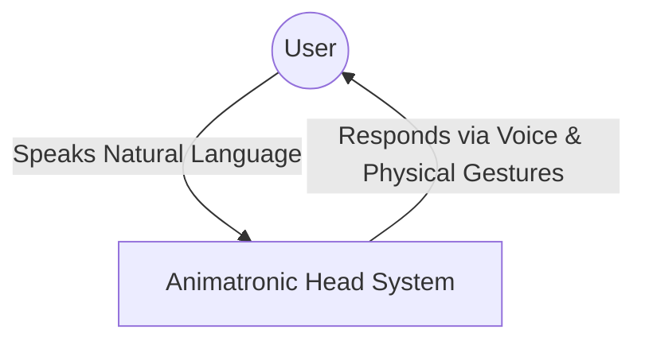
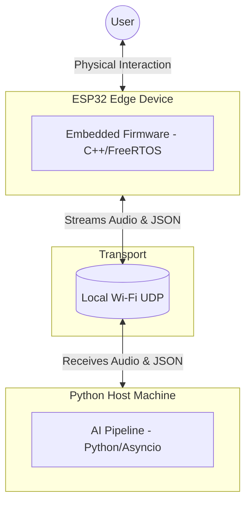
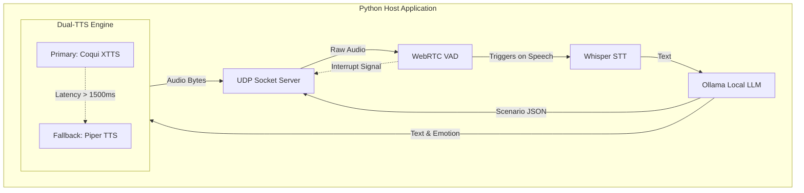
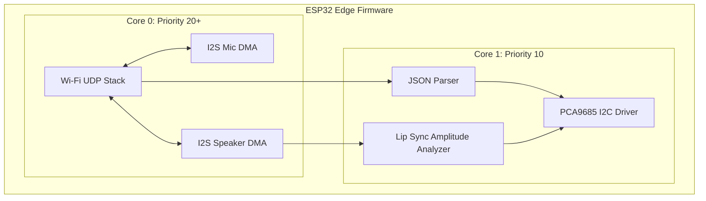
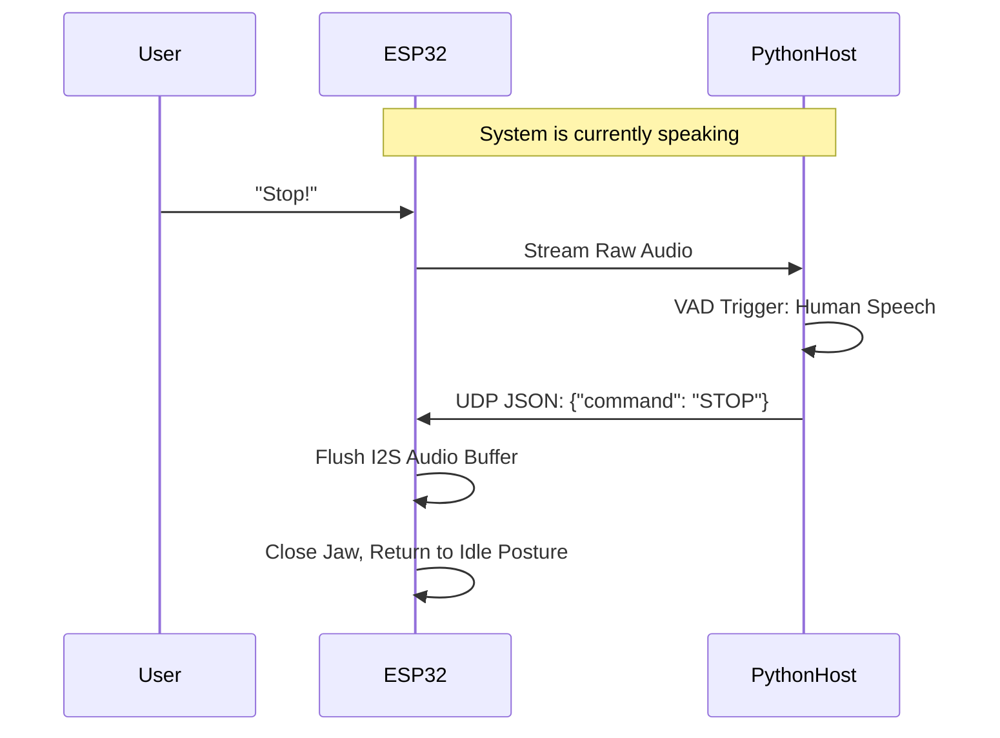
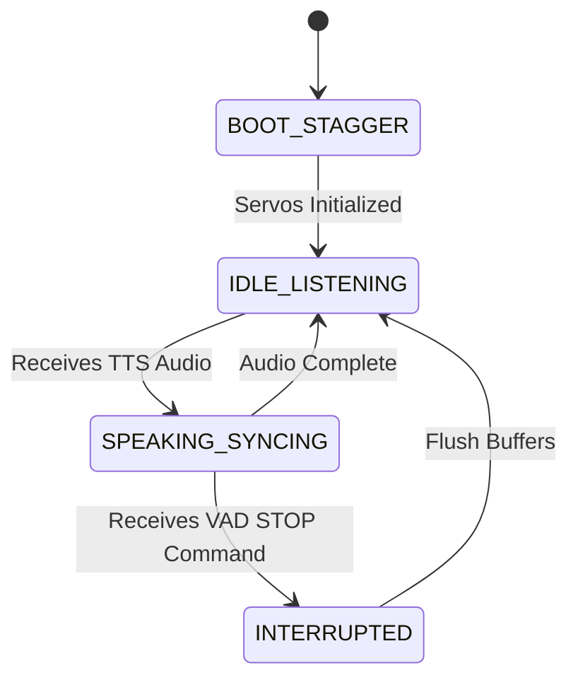

# Software Design Document (SDD)
## for the LLM-Powered Animatronic Head Platform

**Version:** 1.0.0-Draft  
**Date:** July 21, 2026  
**Status:** Architecture Drafting (Sections 1 & 2 Complete)  
**Author:** Software Architecture Team  

---

## 1.0 Document Governance

### 1.1 Title Page & Confidentiality Notice
This document presents the technical design specifications for the Animatronic Head Platform. It is developed as an academic project. While the system architecture and methodologies contained herein are intended for academic review and open-source collaboration, they represent a structured, production-grade approach to embedded AI systems. 

### 1.2 Revision Control Log
| Version | Date | Author | Description of Changes |
| :--- | :--- | :--- | :--- |
| 1.0.0-Draft | 2026-07-21 | Architecture Team | Initial draft of Sections 1.0 and 2.0. Defined Edge/Host split, FreeRTOS priority matrix, and Python framework selections. |
| 1.1.0-Draft | 2026-07-21 | Architecture Team | Drafted Section 3.0 applying the C4 Architecture Model, Dual-TTS Fallback, and behavioral sequence/state diagrams. |

### 1.3 Approvals Signatures
*Under review — awaiting final architectural sign-off.*

---

## 2.0 Introduction

### 2.1 Purpose and Technical Scope
This Software Design Document (SDD) translates the functional baseline defined in the Animatronic Head Software Requirements Specification (SRS) into a concrete, executable technical architecture. It details the bridging of a high-performance Python-based Host environment with a resource-constrained ESP32 Edge device. 

The technical scope encompasses:
*   **Edge Tier:** A "mixed-framework" approach utilizing the Arduino Core for ESP32 (via PlatformIO) combined with low-level ESP-IDF API calls. This allows the use of established libraries for I2C servo control (Adafruit PWM) while retaining strict FreeRTOS task pinning and native I2S DMA buffer control for audio.
*   **Host Tier:** An asynchronous Python architecture (utilizing `asyncio` and `socket`) managing local Large Language Model (LLM) inference, Whisper-based Speech-to-Text (STT), Voice Activity Detection (`webrtcvad`), and Text-to-Speech (TTS).
*   **Transport Tier:** Unencrypted, low-latency UDP streams traversing the local Wi-Fi network to decouple physical I/O from heavy AI compute.

### 2.2 Architectural Goals and Drivers
The architecture is designed to satisfy four primary operational drivers:

1. **Distributed Compute & Decoupling:** The ESP32 lacks the SRAM to run LLMs or process heavy DSP algorithms. The architecture strictly isolates sensory/kinematic I/O to the Edge and cognitive AI processing to the Host.
2. **Deterministic Edge Concurrency (FreeRTOS):** To prevent audio stuttering and mechanical lag, the ESP32 utilizes a strict dual-core FreeRTOS topology:
    *   *Core 0 (Protocol & Audio):* Handles the Wi-Fi stack, UDP packet processing, and I2S DMA interrupts. Assigned **High Priority** (e.g., Priority 20+).
    *   *Core 1 (Kinematics & Logic):* Handles JSON parsing and PCA9685 I2C communication. Assigned **Medium Priority** (e.g., Priority 10) to ensure motor commands never block audio buffers.
3. **Kinematic Safety & Brownout Mitigation:** Transients from 9 servos booting simultaneously will brownout the ESP32. The system utilizes hardware timer-based staged initialization, powering up servos sequentially upon boot.
4. **Real-Time Reactivity:** The Host utilizes non-blocking UDP sockets and a parallel VAD pipeline to instantly detect user speech, allowing it to send an immediate "interrupt" JSON command to the ESP32 to halt TTS playback and jaw movement.

### 2.3 References & Upstream Specifications
1. AnimatronicHead Software Requirements Specification (SRS), v1.0.0-Draft.
2. Espressif ESP-IDF Programming Guide (FreeRTOS & I2S Peripherals).
3. OpenAI Whisper Documentation (STT).
4. WebRTC VAD Documentation (Voice Activity Detection).

### 2.4 Terminology, Definitions & Acronyms
| Term | Definition |
| :--- | :--- |
| **ESP-IDF / Arduino Core** | The C++ frameworks used on the ESP32. The system uses Arduino for easy library integration (like Adafruit PWM) but drops down to ESP-IDF for raw FreeRTOS and I2S control. |
| **FreeRTOS** | Real-time operating system running on the ESP32, allowing precise task prioritization and multi-core pinning. |
| **VAD** | Voice Activity Detection; utilized on the Python Host to identify when a human interrupts the animatronic's speech. |
| **STT / TTS** | Speech-to-Text (Whisper) and Text-to-Speech. |
| **I2S / I2C** | I2S is the serial bus used for the digital mic (INMP441) and amplifier (MAX98357A). I2C is the bus used for the servo driver (PCA9685). |

---

## 3.0 System Architecture & Topology (C4 Model)

### 3.1 Level 1: System Context
The System Context defines the boundary of the Animatronic Head Platform and its interaction with the physical world (The User).



### 3.2 Level 2: Containers
The system is divided into three primary execution environments connected over a local network.



### 3.3 Level 3: Components

#### 3.3.1 Python Host Components
The Host manages the cognitive pipeline asynchronously to ensure the UDP socket is never blocked.



#### 3.3.2 ESP32 Edge Components
The Edge strictly isolates tasks across FreeRTOS cores.



### 3.4 System Behaviors & Data Flow

#### 3.4.1 Audio Interruption Sequence (Data Flow)
When the user speaks over the animatronic, the system must halt immediately.



#### 3.4.2 Edge Kinematic State Machine
To prevent brownouts and manage physical interactions, the ESP32 maintains strict states.



### 3.5 Design Patterns & Computational Philosophies

#### 3.5.1 Dual-TTS Fallback Pattern
To guarantee conversational fluidity, the Host attempts to generate responses using the high-fidelity **Coqui XTTS** engine. If the initial time-to-first-byte latency exceeds the **1500ms baseline threshold** (e.g., due to GPU resource contention), the orchestrator aborts the XTTS thread and immediately routes the text to the CPU-optimized **Piper TTS** engine, prioritizing response speed over maximum fidelity.

#### 3.5.2 Priority-Based Core Pinning
The ESP32 architecture enforces absolute hardware priority for audio. Core 0 is dedicated to the Wi-Fi stack and I2S DMA interrupts to prevent acoustic popping or connection timeouts. Kinematic calculations, JSON parsing, and I2C communications are pinned to Core 1. This decoupling ensures that even if the PCA9685 I2C bus becomes congested during complex multi-servo movements, the audio stream remains uninterrupted.

---

## 4.0 Technical Constraints & Metrics

### 4.1 Physical Performance Constraints
To maintain the illusion of biological reactivity, the architecture must adhere to strict latency SLAs:
*   **Conversational Latency SLA (3.0s):** The total round-trip time—from the user concluding speech, passing through VAD, STT, LLM inference, and TTS audio initiation—must reliably average $\le 3.0$ seconds. Latency spikes above 5.0 seconds will break the ethnographic immersion of the platform.
*   **Lip-Sync Precision ($\le 50$ms):** The ESP32's `LipAnalyzer` task must map the incoming I2S audio amplitude envelope to the jaw servos (Up/Down and Left/Right) with less than 50 milliseconds of delay to ensure phoneme synchronization appears natural.

### 4.2 Edge Hardware Constraints
*   **SRAM Exhaustion Prevention:** The ESP32 cannot buffer full audio files. It must maintain a small, highly optimized circular DMA buffer for I2S output, constantly draining and refilling from the Wi-Fi UDP stream. The Python Host acts as the infinite memory pool for the conversation context.
*   **I2S Peripheral Scarcity:** The ESP32 contains exactly two I2S peripherals. `I2S0` is strictly allocated for the INMP441 Microphone (Input). `I2S1` is strictly allocated for the MAX98357A DAC (Output). No further I2S expansions are possible on this specific MCU.

### 4.3 Security Profiles
*   **Academic Prototype Boundary:** This system is an academic research platform designed for local network execution. Audio and kinematic JSON payloads traverse the Wi-Fi UDP layer **unencrypted** to eliminate TLS handshake overhead and maximize processing speed. Security and isolation are entirely delegated to the physical Wi-Fi router's VLAN/WPA3 configuration.

---

## 5.0 Detailed Design & Service Decomposition

### 5.1 Python Host Pipeline Decomposition
The Host operates an `asyncio` event loop designed to ensure network socket listeners are never blocked by heavy AI inference.
1.  **UDP Socket Server:** Continuously listens for raw audio bytes from the ESP32 and routes them into an asynchronous memory queue.
2.  **WebRTC VAD Worker:** Analyzes the incoming queue in 10-30ms frames to detect human speech.
3.  **StateGraph Orchestrator:** Manages the conversational flow using an explicit LangGraph `StateGraph`. It cycles through `listen_node`, `agent_node` (LLM inference), and `action_node` (Tool Execution). It pulls conversational history from a decoupled `MemoryManager`.
4.  **Dual-TTS Dispatcher:** Receives the LLM text output. Routes to Coqui XTTS, falling back to Piper if generation exceeds the 1500ms threshold. Streams resulting bytes back to the ESP32.

### 5.2 The Deterministic Kinematic Engine (ESP32)
The ESP32 firmware on Core 1 operates the **Contextual Kinematic Controller**. 
To ensure physical safety, the ESP32 acts as the absolute deterministic authority over movement. The Python LLM is inherently non-deterministic and is *only* permitted to transmit abstract cognitive intents (e.g., "SAD") or direct physical commands (e.g., "LOOK_LEFT"). 

The software architecture strictly adheres to three design patterns to guarantee safety and thread concurrency:
1.  **Meyers Singletons:** All primary subsystems (`KinematicEngine`, `PoseController`, `AnimatronicHead`, `NetworkManager`) are instantiated lazily as static references. This eliminates global variable bloat and ensures thread-safe access across FreeRTOS tasks.
2.  **Facade Pattern:** The `AnimatronicHead` class acts as a single, lightweight entry point for all high-level intents. It contains no raw hardware logic. It delegates cognitive routing to the `PoseController` and continuous motor evaluation to the `KinematicEngine`.
3.  **Strict Primitive Composition Pattern:** The `PoseController` translates abstract intents into physical PWM bounds via a two-tier hierarchy.
    *   **Atomic Base Primitives:** 9 private functions (e.g., `moveNeckPan`, `moveJawLR`) form the only bridge to the underlying `KinematicEngine`. Hardware safety clamps (e.g., Jaw lateral boundaries) are embedded here.
    *   **Composite Macros:** Higher-order expressions (e.g., `expressSad`, `blink`) are **strictly prohibited** from communicating directly with the `KinematicEngine`. They must exclusively invoke and compose the Atomic Base Primitives. This guarantees that mechanical constraints cannot be bypassed by a rogue LLM intent.

#### 5.2.1 Non-Blocking State Machine Architecture
To satisfy strict real-time responsiveness constraints, the Kinematic Engine operates as a continuous, non-blocking state machine.
*   **Asynchronous Transitions:** Movement requests do NOT block the thread. They immediately calculate the necessary `duration`, `targetAngle`, and `easingProfile`, store them in a tracking struct, and return execution to the parser.
*   **Continuous Kinematic Loop:** A dedicated `updateKinematics()` routine runs continuously at ~60Hz (15ms tick rate) on Core 1. It recalculates the eased positions for all active servos based on the current system timestamp. This guarantees that Core 1 is never locked in a `delay()` loop and remains instantly available to process UDP VAD interrupts mid-movement.

### 5.3 Emotion-to-Kinematic Translation Algorithms
*   **Easing Functions:** To simulate organic biology, servos do not snap linearly from Point A to Point B. The ESP32 firmware interpolates the path using three mathematical easing curves in `Easing.cpp`: `easeInOutSine` (conversational articulation), `easeInOutCubic` (macro posture shifts), and `easeOutExpo` (rapid micro-movements like blinks and saccades).
*   **Saccadic Eye Movement Generator:** A background micro-task pinned to Core 1 occasionally injects tiny, random positional offsets (derived from a wave-superposition pseudo-random noise generator) to the eye servos when the system is in the `IDLE_LISTENING` state. This replicates human saccades, keeping the avatar feeling "alive" even when it is perfectly quiet.

---

## 6.0 Data Design & Communication Protocols

### 6.1 UDP Audio Payload Structure
Because this system prioritizes extreme low latency over data integrity (a dropped frame of audio is better than a delayed frame), it strictly uses the **UDP** protocol.
*   **Audio Format:** Raw PCM, 16-bit depth, 16000 Hz sample rate, Mono channel. This is the exact format optimal for the Whisper STT engine, eliminating the need for expensive resampling on the Host.
*   **Packet Chunking:** Packets are chunked to $\le 1024$ bytes to remain beneath standard Wi-Fi MTU limits, preventing IP fragmentation and packet reassembly overhead.

### 6.2 The Cognitive Intent Schema (Host -> Edge)
The JSON contract over UDP between the Host and the ESP32 represents pure cognitive intent.

```json
{
  "event_id": "550e8400-e29b-41d4-a716-446655440000",
  "timestamp_ms": 1718923412,
  "cognitive_state": {
     "emotion_primary": "SAD",
     "emotion_secondary": "EMPATHY",
     "intensity_level": 0.8,
     "conversational_phase": "LISTENING"
  },
  "modifiers": {
     "eye_contact_target": "USER",
     "speech_rate": "SLOW"
  }
}
```
*Architectural Scalability:* By restricting the JSON to Enums and intent, physical hardware upgrades to the animatronic (e.g., adding motorized eyebrows) do not require changes to the LLM prompt or the Python host. The developer simply updates the ESP32's `PoseDictionary` to map the "SAD" intent to the new eyebrow servos.

### 6.3 UDP Interrupt Schema (VAD Halt)
When the WebRTC VAD detects user speech, it immediately fires an ultra-lightweight, high-priority JSON packet to the ESP32 to halt the conversation.
```json
{
  "command": "EMERGENCY_STOP"
}
```

---

## 7.0 Hardware & Mechanical Architecture

### 7.1 The 3D-Printed Skull & Actuation Mechanics
The physical animatronic skull relies on exactly 9 hardware servos, broken down by their mechanical roles:
*   **Neck & Multi-Axis Base Platform:** 3× **MG945** High-Torque Metal Gear Servos. These operate in a coordinated arrangement (a Stewart-like platform) to allow pitch, roll, and yaw (nodding, turning, tilting).
*   **Head Alignment / Stabilization:** 1× **HX5010** Large Standard Servo positioned at the top of the head. It utilizes a wired iron mechanism to keep the head aligned and stabilize it from the top.
*   **Speech Mechanism (Jaw):** 2× **SG90** Micro Servos powering the top jaw and the bottom jaw for phonetic lip-sync.
*   **Ocular & Facial Expressions:** 3× **SG90** Micro Servos controlling eye horizontal/vertical look vectors and upper/lower eyelid blinking/winking mechanics via thin pushrods.

### 7.2 Core Peripheral Components
The architecture leverages specific hardware modules to offload processing from the ESP32 CPU.

**A. The Audio Input: INMP441 Omnidirectional Microphone**
*   *What it is:* A high-performance, low-power digital microphone.
*   *Why we use it:* Analog microphones require the ESP32's internal Analog-to-Digital Converter (ADC), which is notoriously noisy. The INMP441 outputs pure digital audio using the **I2S protocol**, bypassing the ADC entirely and delivering crystal-clear PCM data straight to memory via DMA. This is crucial for accurate Speech-to-Text (Whisper) transcription.
*   *How it connects:* Connected to the ESP32's **I2S0** peripheral using three pins: Word Select (WS/LRC), Bit Clock (BCLK), and Serial Data (SD).

**B. The Audio Output: MAX98357A I2S Class-D Amplifier**
*   *What it is:* A digital pulse-density modulation (PDM) audio amplifier.
*   *Why we use it:* Outputting analog audio directly from the ESP32's internal DAC results in severe static. The MAX98357A takes the pure digital I2S audio stream and internally converts and amplifies it to drive a physical speaker.
*   *How it connects:* Connected to the ESP32's **I2S1** peripheral (separate from the microphone) using BCLK, LRC, and DIN pins.
*   *Physical Constraint:* The ESP32 only has two I2S peripherals. Therefore, both I2S0 and I2S1 are fully saturated. No further high-speed digital audio devices can be added.

**C. The Muscle Controller: PCA9685 16-Channel PWM Driver**
*   *What it is:* A microchip that generates 12-bit Pulse Width Modulation (PWM) signals across 16 independent channels.
*   *Why we use it:* Generating 9 stable PWM signals simultaneously using ESP32 timers consumes excessive CPU cycles and causes "servo jitter" when Wi-Fi is active. The ESP32 simply tells the PCA9685 the target angle, and the PCA9685 holds that pulse perfectly steady using its internal clock.
*   *How it connects:* Connected via the **I2C protocol**, using only two wires: Serial Data (SDA on GPIO 21) and Serial Clock (SCL on GPIO 22).

**D. The Acoustic Transducer: 4Ω 4311 Mid-Range Speaker/Tweeter**
*   *What it is:* A physical 4 Ohm, 4311 cone speaker driver designed for mid-to-high frequency acoustic reproduction.
*   *Why we use it:* To give the animatronic a clear, resonant voice. A standard 8Ω speaker might not draw enough power from the 3.2W amplifier to be loud enough. A 4Ω speaker perfectly matches the MAX98357A's maximum power output, ensuring the TTS voice is punchy and audible across a room without distortion.
*   *How it connects:* Hardwired directly to the positive and negative output terminals of the MAX98357A.

### 7.3 Power Infrastructure & Current Mitigation
*   **The Power Supply:** The system is powered by a massive **5V, 10A AC/DC Adapter (Model YU0510)**. 
*   **The Electrical Topology:** The 10A adapter is wired directly into the green terminal block of the PCA9685. The delicate ESP32 3.3V logic circuit is kept electrically isolated from this high-current motor bus. Because the supply provides 10 Amps, the system possesses more than enough overhead to drive all 9 servos simultaneously (which peak around 8A-10A) without causing voltage sag.

### 7.4 Field Learnings & Known Hardware Defects
Rigorous physical field testing of the 3D-printed skull has revealed specific hardware degradation. To ensure software reliability, the ESP32 `PoseDictionary` must actively accommodate these mechanical defects:
*   **Defect 1: Right Eyelid Servo Unreliability:** The right eyelid servo experiences significant binding/slipping.
    *   *Software Mitigation:* Do not rely on independent eyelid movements (e.g., winking). The right eyelid should be driven at a lower priority. The software should mathematically mirror or gently blend its movements with the reliable left eyelid servo, masking the physical defect by using macro facial expressions rather than isolated articulation.
*   **Defect 2: Jaw Left/Right Articulation Binding:** The Jaw L/R servo suffers from highly restricted motion and binds easily, risking motor burnout.
    *   *Software Mitigation:* Do not rely heavily on lateral jaw movement during TTS lip-sync. The Jaw L/R servo should be treated as a low-priority actuator. Its PWM boundaries must be aggressively clamped in `Config.h`, and its movement should only be subtly blended into major expressions rather than acting as a primary articulation axis.

---

## 8.0 Development & Deployment

### 8.1 Edge Build Environment (ESP32)
*   **PlatformIO:** The firmware is developed using the PlatformIO IDE extension within VSCode (`platformio.ini`). It utilizes the `espressif32` platform and the `arduino` framework to enable rapid integration of third-party libraries (e.g., Adafruit PWM), while strictly leveraging ESP-IDF API headers (`<driver/i2s.h>`, `<freertos/FreeRTOS.h>`) for low-level peripheral and task management.

### 8.2 Python Host Build Environment
*   **`uv` Package Manager:** To ensure lightning-fast dependency resolution and robust virtual environments, the Python Host tier utilizes **`uv`** (by Astral) instead of standard `pip` or `venv`. This is critical given the massive size of the AI dependencies (PyTorch, Whisper, TTS models).

### 8.3 Architecture Retrospective
*   *Why UDP?* TCP packet delivery guarantees introduced unacceptable latency jitter. UDP allows dropped audio frames to pass instantly, mimicking real acoustic propagation.
*   *Why Deterministic Kinematics?* Early testing proved that allowing the LLM to output numerical angles directly posed an extreme risk to the fragile 3D-printed gears. By restricting the LLM to abstract intents (e.g., "SAD") and offloading the math to the ESP32, we mathematically guaranteed hardware safety.

---

## 9.0 Appendices

### 9.1 Approved Technology Manifest
| Classification | Standard Selection | Purpose |
| :--- | :--- | :--- |
| **Edge Compute** | ESP32 (FreeRTOS) | Real-time dual-core hardware execution |
| **Edge Framework** | PlatformIO (Arduino + ESP-IDF) | C++ compilation and dependency management |
| **Network Protocol** | UDP / IPv4 | Ultra-low latency, unencrypted data transport |
| **Host Runtime** | Python 3.11+ (`uv` managed) | High-performance asynchronous AI orchestration |
| **Speech-to-Text** | OpenAI Whisper | High-accuracy offline transcription |
| **Language Model** | Ollama | Local context-aware intent generation |
| **Text-to-Speech** | Coqui XTTS (Primary) / Piper (Fallback) | Dual-TTS for expressive audio with a low-latency fallback |
| **Voice Activity** | WebRTC VAD | Real-time human speech interruption detection |
