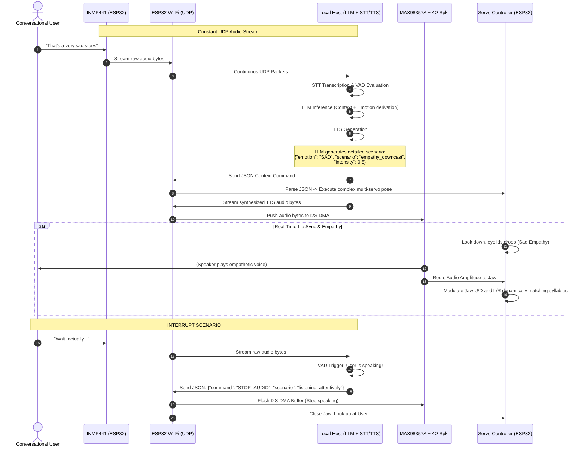

# Software Requirements Specification (SRS)
## for the LLM-Powered Animatronic Head Platform

**Version:** 1.0.0-Draft  
**Status:** Under Review (Phase 4: Interfaces & Non-Functional Requirements)  

---

## 1. Introduction

### 1.1 Purpose
This Software Requirements Specification (SRS) defines the operational capabilities, hardware integrations, and behavioral logic of the **Animatronic Head Platform**. It establishes the baseline requirements for a fully autonomous, LLM-driven physical avatar capable of engaging in intelligent conversation, deriving context-aware emotions, and expressing those emotions through lifelike physical movements.

This document prioritizes the logical boundaries of the system, defining "WHAT" the system must perceive (audio input, proximity), process (LLM reasoning on a local host), and execute (I2S audio output and I2C servo articulation).

### 1.2 Scope
The Animatronic Head is an interactive robotic platform designed to bridge the gap between digital AI and physical presence. The system listens to human speech, interprets intent and emotional subtext via an off-board local LLM (e.g., Ollama/Mistral/Qwen), and physically responds with coordinated head tracking, facial expressions, and synthesized voice over Wi-Fi communication.

Major functional domains of scope include:
*   **Conversational AI Brain (Host-side)**: Integration with a local Large Language Model (LLM) running on a host machine to process natural language, maintain conversational context, and autonomously decide the emotional and physical response state.
*   **Audio Perception & Output (Edge-side)**: Real-time voice capture utilizing an I2S omnidirectional microphone (INMP441) and responsive speech synthesis driven through an I2S Class D audio amplifier (MAX98357A) driving a dedicated 4Ω 4311 midrange cone tweeter.
*   **Dynamic Emotional Articulation**: Automated translation of LLM-derived emotional states and situational context into complex, lifelike servo movements (easing curves, saccadic eye darts, and idle micro-movements) on the ESP32.
*   **Real-time Lip Synchronization**: Analyzing audio output to dynamically move the jaw (Up/Down and Left/Right) in perfect synchronization with the spoken text to simulate realistic speech.
*   **Proximity Tracking (Nice-to-Have)**: Utilizing an ultrasonic sensor to detect user presence and distance, providing basic spatial awareness to orient the animatronic head toward the speaker.
*   **Extensible Agentic Framework (Future Scope)**: Foundational architecture designed to support future modular upgrades, including real-world tool execution and advanced environmental sensors.

### 1.3 Definitions, Acronyms, and Abbreviations
| Term | Definition |
| :--- | :--- |
| **LLM** | Large Language Model; the AI engine hosted on a local computer (e.g., Ollama) responsible for natural language understanding and dialogue generation. |
| **I2S** | Inter-IC Sound; a serial bus interface standard used for connecting digital audio devices (used by INMP441 and MAX98357A). |
| **INMP441** | An omnidirectional, high-performance, low-power digital I2S microphone module used for speech input. |
| **MAX98357A** | An I2S digital-to-analog converter (DAC) and Class D audio amplifier module required to boost the digital audio signal to drive the physical 4Ω speaker. |
| **4Ω 4311 Speaker** | The physical cone tweeter/midrange driver providing the acoustic output for the animatronic voice. |
| **Saccade** | A rapid, jerky movement of the eyes between fixation points; replicated in firmware to simulate organic eye movement. |
| **VAD** | Voice Activity Detection; logic used to identify when a human is speaking to allow for conversation interruptions. |

---

## 2. Overall Description

### 2.1 Product Perspective
The Animatronic Head operates within a **Distributed Edge-Host Architecture**. 
*   **The Host (Master AI):** A local computer running the heavy computational workloads: Large Language Model (LLM) inference, Speech-to-Text (STT) parsing, and Text-to-Speech (TTS) generation.
*   **The Edge (Hardware Controller):** An ESP32 microcontroller acting as a real-time sensory and actuation client. It continuously streams raw I2S microphone data to the host over UDP, receives compressed audio responses, and parses detailed JSON commands into precise physical servo movements via the PCA9685.

This split architecture guarantees that the physical animatronic movements remain fluid and real-time without being bottlenecked by the heavy memory and compute requirements of AI inference.

### 2.2 Product Functions
*   **Sensory Input**: Continuous capture of high-fidelity ambient audio via the INMP441 omnidirectional microphone.
*   **Voice Articulation**: Real-time playback of host-generated TTS audio using the MAX98357A amplifier and 4Ω speaker.
*   **Organic Movement Mapping**: Conversion of rich contextual states into continuous, life-like physical interpolations utilizing 9 mechanical servos (4 standard, 5 micro).
*   **Conversation Interruption**: Capability to halt speech and return to a listening state if the user begins speaking over the avatar.

### 2.3 User Characteristics (Stakeholders & Roles)
*   **The Developer / Maintainer**: Requires comprehensive API access, debugging logs, and modular code structures (like `Config.h`) to calibrate servo limits and test communication streams.
*   **The End-User (Interlocutor)**: Expects a seamless, latency-free conversational experience. The user interacts purely through natural spoken language and expects the avatar to maintain "eye contact", project appropriate physical empathy, and sync its mouth to its words.

### 2.4 Constraints
#### 2.4.1 Hardware Constraints (ESP32 & Mechanisms)
*   **Memory & Compute Limits**: The ESP32 is constrained to ~520 KB SRAM. Therefore, LLM processing MUST be strictly offloaded to the host machine. The ESP32 is restricted to I/O buffering and real-time kinematic calculations.
*   **I2S Peripheral Scarcity**: The ESP32 contains precisely two I2S peripherals. These must be strictly allocated: one for the INMP441 (Audio RX) and one for the MAX98357A (Audio TX). No other I2S devices can be added.
*   **Physical Kinematics**: The 3D-printed skull mechanism dictates specific servo linkages. Software limits MUST strictly adhere to the calibrated limits in `Config.h` to prevent physical stripping of the 3D-printed gears.

#### 2.4.2 Software Constraints (FreeRTOS & Hardware Timers)
*   **Audio Pipeline Priority**: Audio streaming tasks (I2S DMA over UDP) require absolute real-time priority to prevent audio popping, stuttering, or microphone dropouts. 
*   **I2C Bus Congestion**: The PCA9685 communicates over the I2C bus. Continuous micro-movements (Idle Mode) must be rate-limited (e.g., ~50Hz) to prevent starving the I2C bus and triggering FreeRTOS watchdog timeouts.
*   **Task Separation & Watchdogs**: Sensory polling, UDP Wi-Fi communication, audio DMA handling, and servo kinematics MUST be separated into distinct, carefully prioritized FreeRTOS tasks. Task Watchdog Timers (TWDT) MUST be utilized.

#### 2.4.3 Power / Physical Constraints
*   **Current Draw (Brownouts)**: 4 Standard Servos and 5 Micro Servos draw massive transient currents. To prevent Logic Brownouts, the software MUST maintain the PCA9685 in "Sleep Mode" (PWM disabled) on initial boot. Initialization of the servos MUST be staggered utilizing hardware timers rather than occurring simultaneously.

### 2.5 Assumptions and Dependencies
*   **Local Host Availability**: The system assumes continuous availability and low-latency Wi-Fi UDP connection to the host machine.
*   **Mechanical Integrity**: Assumes the physical ball links and micro-servos are properly calibrated and lubricated, allowing the software's mathematical curves to translate into physically smooth motion without binding.

---

## 3. System Features (Functional Requirements)

### 3.1 User Stories & Use Cases

#### 3.1.1 The Conversational Interaction Workflow (UDP Streaming & Lip Sync)
This workflow defines the continuous communication loop, highlighting the UDP audio transmission, detailed contextual logic, real-time lip synchronization, and the Voice Activity Detection (VAD) interruption capability.

### 3.2 Specific Feature Requirements

#### 3.2.1 Real-Time Audio Streaming (UDP)
*   **SR-AUD-001 (Continuous UDP Uplink)**: The ESP32 MUST maintain a persistent UDP stream transmitting INMP441 I2S data to the Host to simulate an "always-listening" phone call topology.
*   **SR-AUD-002 (MAX98357A Amplification)**: Downlink audio MUST be routed via I2S to the MAX98357A DAC/Amplifier, correctly configured to drive the 4Ω 4311 midrange speaker without clipping.

#### 3.2.2 Real-Time Lip Synchronization
*   **SR-SYNC-001 (Audio-Kinematic Coupling)**: The ESP32 MUST analyze the incoming TTS audio buffer (e.g., via amplitude envelope tracking) or receive pre-calculated phoneme timing metrics from the Host.
*   **SR-SYNC-002 (Multi-Axis Jaw Articulation)**: The detected audio envelope MUST drive both the `JAW_UD` (Up/Down) and `JAW_LR` (Left/Right) servos simultaneously to simulate organic, chaotic speech articulations rather than simple binary flapping.

#### 3.2.3 Contextual Kinematic Controller (ESP32)
*   **SR-KIN-001 (Complex Pose Generation)**: The physical response MUST NOT be limited to atomic emotions (e.g., "Happy"). The controller MUST interpret rich contextual scenarios. For example, "Happy" MUST execute a synchronized macro: tilting the neck up, opening the eyes wide, and slightly opening the jaw to form a smile. The Host is capable of instructing the Edge to move silently (Phase `MOVING`) or in sync with audio (Phase `SPEAKING`).
*   **SR-KIN-002 (VAD Interruption Halts)**: Upon receiving an interruption signal from the Host's Voice Activity Detection, the ESP32 MUST immediately flush the I2S playback buffer, cease jaw movement, and snap to a "listening" physical posture.
*   **SR-KIN-003 (Deterministic Kinematic Authority)**: The ESP32 firmware SHALL act as the absolute deterministic authority over all physical actuation. The Host LLM is inherently non-deterministic and SHALL ONLY output abstract cognitive intents. The ESP32 MUST map these abstract intents to mathematically safe, hardcoded physical constraints via a local Pose Dictionary to categorically prevent hardware binding or gear stripping.
*   **SR-KIN-004 (Non-Blocking Real-Time Kinematics)**: The kinematic controller MUST operate as a continuous, non-blocking state machine. Physical movements MUST NOT block the execution thread (e.g., no long `delay()` loops). The system MUST be capable of receiving and processing an immediate interrupt (like an EMERGENCY_STOP from the VAD) mid-movement without waiting for a servo to finish its current traversal.

#### 3.2.4 Host Intelligence Module (Local PC)
*   **SR-HOST-001 (Rich Contextual Generation)**: The LLM prompt template MUST constrain the output to provide detailed JSON describing the `scenario`, `context`, and `emotion` (e.g., `empathy_downcast`, `excited_storytelling`) to give the ESP32 granular data for physical articulation.
*   **SR-HOST-002 (VAD Arbitration)**: The Host MUST run a low-latency VAD algorithm on the incoming UDP stream. If user speech is detected while the system is generating or playing TTS, it MUST immediately send a halt command to the ESP32 to simulate a natural conversation interruption.

### 3.3 Subsystem Role Specifications

| Subsystem | Functional Goal | Primary Inputs | Primary Outputs | Operational Constraints |
| :--- | :--- | :--- | :--- | :--- |
| **Edge Audio (ESP32 + MAX98357A + 4Ω Spkr)** | Handle bidirectional high-bandwidth Wi-Fi audio. | I2S Mic Data (INMP441), UDP Packets. | I2S Speaker Data (MAX98357A), UDP Packets. | Must never block for >10ms to prevent audio stuttering. |
| **Edge Motion (ESP32 Core 1)** | Drive lifelike physical responses, idle behaviors, and Lip Sync. | JSON Scenario Commands, Audio Amplitude Data. | I2C PWM Signals (PCA9685). | Must map audio envelope to `JAW_UD` and `JAW_LR` at $\ge 20$Hz. |
| **Host Brain (Local PC)** | Synthesize natural language, detailed scenarios, and VAD interrupts. | UDP Audio Streams. | UDP Audio Streams, JSON State Commands. | Requires high GPU/CPU availability for low-latency TTS/STT and VAD. |

---

## 4. External Interface Requirements

### 4.1 User Interfaces
The system fundamentally operates without a graphical user interface (GUI). The "Interface" is entirely physical and acoustic, anchored by the Animatronic Head's physical presence and voice.
*   **UR-UI-001 (Headless Interaction)**: The end-user MUST be able to interact with the system entirely through natural spoken language without referencing a screen, pressing buttons, or monitoring software states.

### 4.2 Hardware Interfaces
*   **Edge Hardware**: The ESP32 utilizes the **I2S protocol** (Inter-IC Sound) to interface directly with the INMP441 digital microphone and the MAX98357A Audio Amplifier. 
*   **Kinematic Interface**: The ESP32 utilizes the **I2C protocol** to interface with the PCA9685 16-channel PWM driver to manipulate the 9 physical servos.

### 4.3 Software Interfaces
*   **Developer Telemetry & Logging**: Because there is no Web UI, the system MUST expose rigorous diagnostic telemetry for the developer.
    *   **Host Logs**: The Local PC MUST output standard `stdout` terminal logs detailing STT transcripts, LLM JSON outputs, and UDP transmission statuses.
    *   **Edge Logs**: The ESP32 MUST output debugging telemetry over the physical USB Serial Monitor (baud rate 115200), logging Wi-Fi connection states, UDP packet losses, and servo initialization steps.

### 4.4 Communications Interfaces
*   **SR-COMM-001 (Unencrypted UDP)**: As an academic research project, the primary network transport for continuous audio streaming between the ESP32 and Host SHALL be raw, unencrypted UDP over local Wi-Fi to minimize protocol overhead and latency. 

---

## 5. Non-Functional Requirements

### 5.1 Performance Requirements
*   **NFR-PERF-001 (Conversational Latency SLA)**: To maintain the illusion of consciousness, the total round-trip time—measured from the moment the user stops speaking, passing through STT, LLM inference, TTS generation, and returning to the ESP32 for acoustic playback—MUST average **$\le 3.0$ seconds**, and MUST NEVER exceed a strict maximum threshold of **$5.0$ seconds**.
*   **NFR-PERF-002 (Lip-Sync Precision)**: The kinematic mapping between the audio amplitude envelope and the Jaw servos (Up/Down, Left/Right) MUST execute with a latency of $\le 50$ milliseconds relative to acoustic output to ensure believable phoneme synchronization.

### 5.2 Safety Requirements
*   **NFR-SAFE-001 (Hardware Binding Protection)**: The software MUST strictly enforce the boundary angles defined in `Config.h` before executing any LLM-directed movement. The LLM is untrusted and cannot be permitted to command angles that would physically break the 3D-printed skull mechanisms.

### 5.3 Security Requirements
*   **NFR-SEC-001 (Open Local Network)**: Security constraints are explicitly defined as Out-Of-Scope for this academic prototype. Audio payloads and JSON kinematic commands traverse the local Wi-Fi network unencrypted. Network segregation and security are delegated entirely to the external physical router configuration.

### 5.4 Quality Attributes
*   **Reliability**: The ESP32 firmware MUST implement automatic Wi-Fi reconnection logic and continuous UDP socket recovery, ensuring the system can heal itself if the local router drops packets.
*   **Usability**: The interaction flow is modeled entirely on human ethnographic standards; the animatronic head MUST utilize Voice Activity Detection (VAD) to allow users to interrupt its speech naturally, exactly as a human would.
